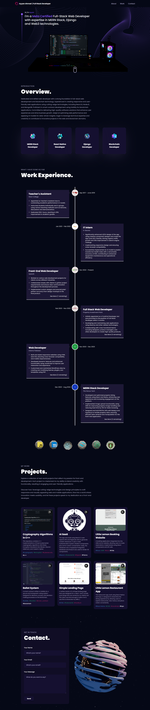

# Portfolio Website 🌟

[](https://ayyanahmed-portfolio.netlify.app/)
[](https://github.com/AyyanYe/Portfolio-Website/blob/main/LICENSE)
[](https://react.dev/)
[](https://vitejs.dev/)

Welcome to my professional portfolio website! This project showcases my technical expertise, projects, and professional journey in a modern, responsive, and interactive format. Built with cutting-edge technologies and designed for performance, it reflects my commitment to clean code and user-centric design.

---

## 🚀 Features

- **Modern UI/UX**: Smooth animations, minimalist design, and responsive layouts.
- **Dynamic Content**: Projects displayed with filtering capabilities (Web/Mobile/All).
- **Interactive Elements**: Click-to-copy email, animated transitions, and hover effects.
- **SEO Optimized**: Meta tags, alt text, and semantic HTML for better search visibility.
- **Performance**: Optimized assets and lazy loading for fast load times.

---

## 🛠️ Tech Stack & Skills Showcase

### Core Technologies
| Category       | Technologies/Libraries                                                                 |
|----------------|---------------------------------------------------------------------------------------|
| Frontend       | React 18, Vite 4, JavaScript (ES6+)                                                   |
| Styling        | CSS3, Flexbox, CSS Grid, Media Queries (Responsive Design)                            |
| Animations     | Framer Motion, CSS Transitions, Three.js                                              |
| Tooling        | npm, Git, GitHub, Netlify (Deployment)                                                |

### Key Libraries
- **`react-icons`**: Scalable vector icons for consistent UI.
- **`react-intersection-observer`**: Efficient scroll-based animations.
- **`react-router-dom`**: Seamless client-side routing.
- **`react-tilt`**: Interactive hover effects on project cards.

---

## 📂 Project Structure

```bash
src/
├── assets/            # Images, fonts, and static files
├── components/        # Reusable UI components (Header, ProjectCard, etc.)
├── constants/         # Data constants (projects, skills, social links)
├── sections/          # Page sections (About, Projects, Contact)
├── styles/            # Global and component-specific CSS
├── App.jsx            # Main application component
└── main.jsx           # Entry point with ReactDOM render
```

---

## 🌐 Live Deployment

The portfolio is deployed on **Netlify** with CI/CD pipeline for automatic updates:  
🔗 **Live URL**: [https://ayyanahmed-portfolio.netlify.app/](https://ayyanahmed-portfolio.netlify.app/)

  

---

## 🧑💻 Development Setup

1. **Clone the repository**
   ```bash
   git clone https://github.com/AyyanYe/Portfolio-Website.git
   cd Portfolio-Website
   ```

2. **Install dependencies**
   ```bash
   npm install
   ```

3. **Run locally**
   ```bash
   npm run dev
   ```

4. **Build for production**
   ```bash
   npm run build
   ```

---

## 📜 License

This project is licensed under the MIT License - see [LICENSE](LICENSE) for details.

---

## 🤝 Contributing

While this is a personal portfolio, constructive feedback is welcome!  
Please open an issue first to discuss proposed changes.

---

## 📬 Connect With Me

[](https://www.linkedin.com/in/ayyan-ahmed/)
[](https://github.com/AyyanYe)
[](mailto:ayyanahmed@outlook.com)

---

🔨 **Crafted with precision**  
This repository demonstrates professional-grade skills in modern web development, including component architecture, performance optimization, and deployment best practices. The codebase prioritizes maintainability and scalability while delivering an engaging user experience.
